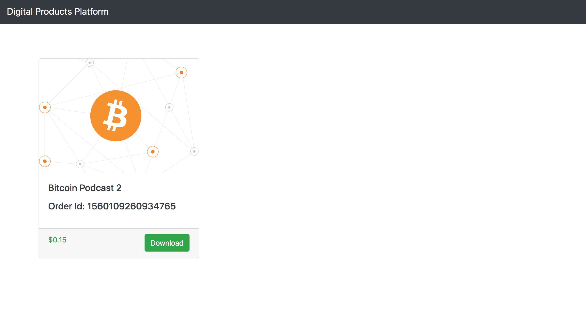

# Digital Products Platform

Digital Products Platform is a customised platform for the seller to sell 
digital goods online and receive payments through bitcoin main chain or 
lightning networks. Once the payment is successful, then the user is 
directed to a link where he can download the digital goods. 
This platform provides a smooth purchase experience for the user. 
The seller does not have to manage the payment logic for the 
lightning networks or bitcoin main chain. Digital goods are the best use cases 
for lightning networks. These are the micro transactions which the users do 
frequently. Users can easily purchase things like podcast, music, books, 
courses, etc at the click of a button and scanning the barcode using 
their phone's wallet. 


## Screenshots
### Homepage


### Payment Method Selection Page


### Payment Page


### Order Success Page


### Opennode Dashboard


## Getting started
1) Clone Repo
   ```
   git clone https://github.com/viraja1/digital_products_platform.git 
   ```  

2) Change directory
   ```
   cd digital_products_platform
   ```
   
3) Register for Opennode dev account and get the API Keys
   https://developers.opennode.co/docs/environments 
   
4) Add the API key as an environment variable
   ```
   export OPENNODE_API_KEY=ACTUAL_API_KEY
   ```
   
5) Start the server
   ```
   python app.py
   ```
   
6) Check the homepage
   
   http://localhost:5000
   
7) Purchase a Product

   Select a product and then click on the Buy button. 
   You will then be redirected to the payment page. 
   Select bitcoin main chain or lightning network as the payment method. 
   You will then be shown a barcode to make the payment. Scan it using your
   mobile wallet and confirm the transaction. Once the payment is successful,
   then an option will be shown to return back to site. Click on that button. 
   You will then be taken to a page where you can download the digital goods.
   
   